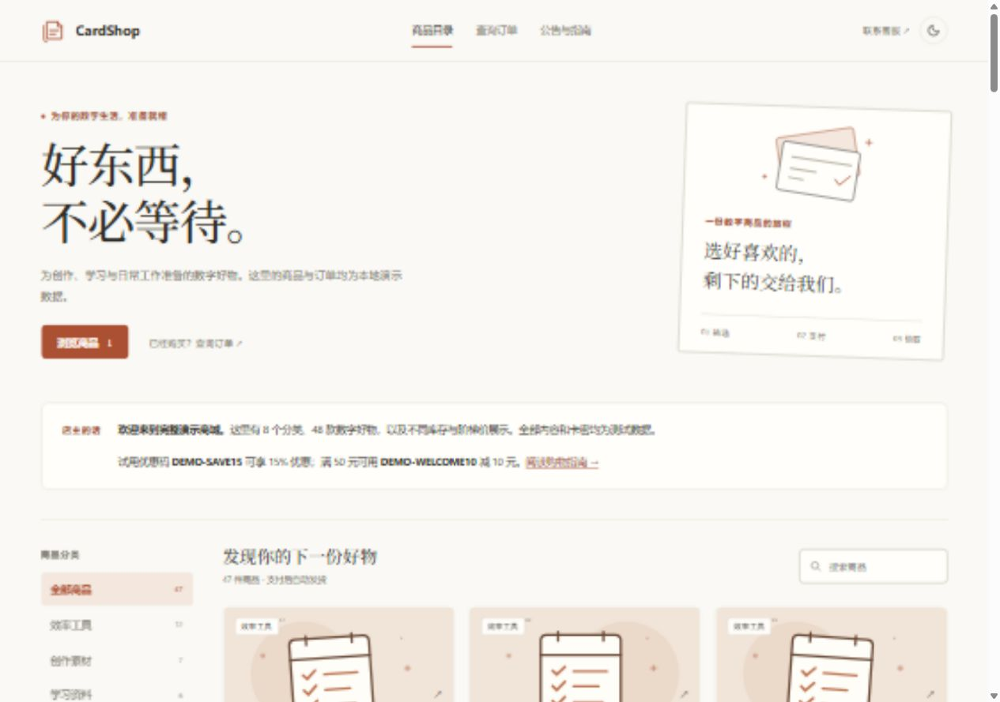
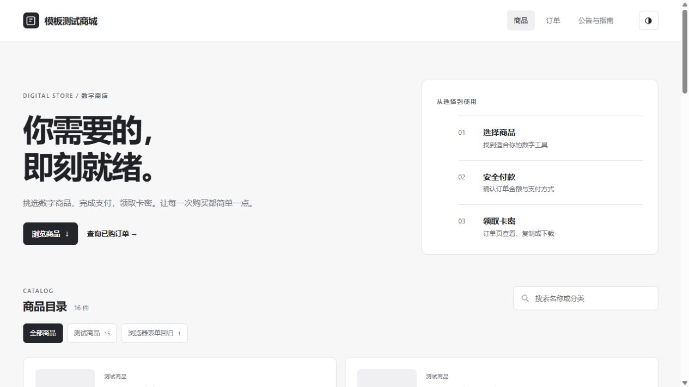
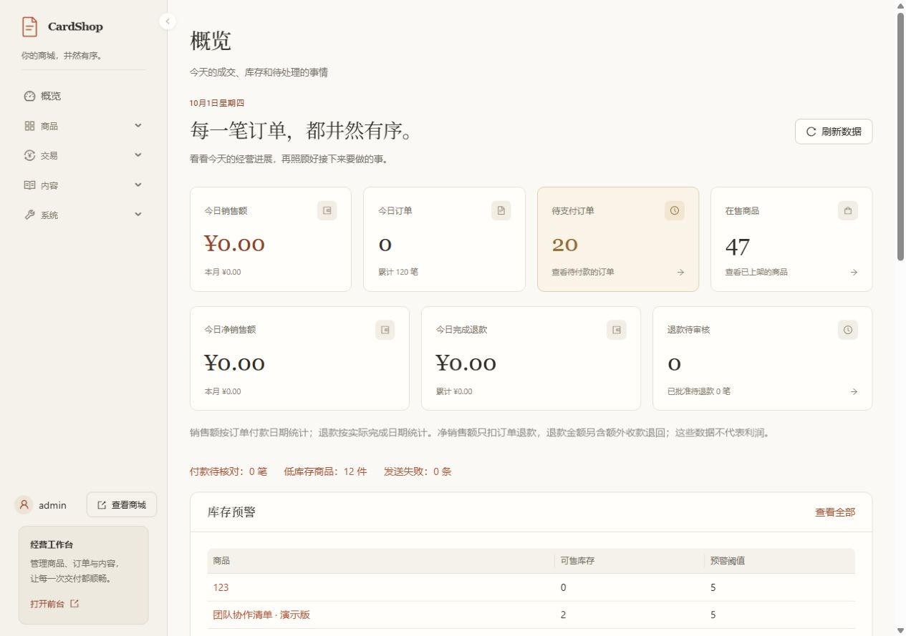

# CardShop · 数字商品自动交付平台

CardShop 是面向个人店铺的自托管发卡商城，覆盖商品展示、下单付款、卡密交付、订单查询、退款审核和售后换卡，也提供库存、员工权限、通知与备份管理。

后端使用 **Laravel 12 + PostgreSQL + Redis**，管理后台使用 **React + Ant Design**。提供三套独立前台模板和 Docker Compose 安装方案，支持易支付支付宝/微信及 EPUSDT / BEpusdt USDT 收款。

**当前正式版本：[v1.0.6](https://github.com/674542449/card-shop/releases/tag/v1.0.6)** · [下载正式版](https://github.com/674542449/card-shop/releases/latest) · [首次安装](DEPLOY.md) · [架构说明](docs/ARCHITECTURE.md) · [API 文档](docs/API.md) · [模板开发](docs/THEMES.md) · [测试记录](tests/README.md) · [MIT 许可证](LICENSE)

## 功能介绍

| 功能 | 能做什么 |
| --- | --- |
| 商品与库存 | 分类、全目录搜索、服务器分页、商品说明、上下架、购买数量限制、阶梯价格、卡密 TXT/CSV 导入、低库存预警 |
| 买家购买 | 无需注册；填写邮箱和查询密码，试算优惠，选择付款方式，下单后查看支付进度与交付结果 |
| 卡密交付 | 服务端核验有效付款后发卡，支持复制、TXT 下载和邮件投递；查单显示当前有效卡密 |
| 订单查询 | 邮箱与查询密码验证，可指定订单号精确查找、继续查询历史订单、取消未付款订单 |
| 支付核对 | 超时释放库存，处理迟到及重复付款、异常回执、手动或定时对账；异常收款提示买家避免重复支付 |
| 退款与售后 | 店主控制退款开关，申请与审核、剩余退款余额、公开处理说明、完成凭证；售后换卡及替换历史 |
| 店铺管理 | 销售额、退款额、净销售额与趋势，订单筛选和 CSV 导出，优惠码、黑名单、操作日志、素材管理 |
| 账户与权限 | 店主及员工账户、按功能授权、独立卡密和资金权限、可选验证器双重验证、一次性恢复码 |
| 内容与外观 | 三套模板、深色模式、公告、弹窗、联系方式、文章与内嵌商品卡片、富文本和 Markdown |
| 通知与 SEO | 邮件及 Telegram 持久队列、失败重试；页面 TDK、Sitemap、JSON-LD、百度推送、Bing IndexNow |
| 备份与维护 | 异步完整备份、任务进度与重试、每日定时、保留策略、已挂载异机目录复制、恢复校验、运行健康告警 |
| API 对接 | Bearer Token、接口范围、有效期、IP/CIDR 白名单、请求与库存占用额度、下单幂等键 |

### 下单与交付

1. 买家选择商品和数量，填写邮箱、查询密码，可使用优惠码。
2. 服务端重新校验商品、价格、折扣、数量和库存，创建订单并预留卡密。
3. 买家通过支付链接付款；商城验签并核对订单、渠道、金额及付款流水。
4. 有效付款完成后交付卡密，邮件进入持久队列，买家可以随时重新验证查单。

试算不占库存或优惠次数，提交订单时重新计价。最终实付最低 **¥0.01**，当前不提供免费自动发货。付款等待按订单实际期限检查，网络异常可手动重查；查询授权到期后需要重新验证。

网页每个 IP 最多保留 3 笔待付款订单，到期或取消后实际释放库存才恢复额度。客户端提交的金额、付款状态或卡密不会作为交付依据。

### 支付方式

| 支付方式 | 配置要求 |
| --- | --- |
| 支付宝 / 微信 | 易支付商户网关地址、商户 ID 和密钥 |
| USDT · EPUSDT | 单独部署 [EPUSDT](https://github.com/assimon/epusdt)，使用网关默认网络 |
| USDT · BEpusdt | 单独部署 [BEpusdt](https://github.com/v03413/BEpusdt)，支持选择 TRC20 / BEP20 / Polygon |

商城不包含支付商户开户或链上网关部署。店主在「系统设置」选择与实际服务匹配的网关。USDT 创建交易要求 HTTPS，回环开发地址除外；主动对账还要求网关能返回可核对的订单、流水和金额，详见 [支付配置](DEPLOY.md#支付与邮件)。

异常有效收款保存回执供财务核实；有权限的管理员才能人工确认发货。订单取消不会撤销网关已受理的付款，迟到付款仍按实际回执处理。

### 退款与售后换卡

**退款申请默认关闭。** 只有店主可以在 **系统设置 → 订单设置 → 启用退款申请** 开启。关闭时，服务器拒绝买家和后台创建新申请；已有记录仍能查看和处理。

退款按每笔付款回执的剩余余额控制，未完成申请预占额度。买家可查看公开处理说明和完成时间，内部备注不公开。**批准退款不会自动调用支付网关转账**：操作员须在支付渠道完成实际打款，再登记凭证。已交付卡密不会重新入库。

售后换卡同时要求订单与卡密修改权限，从同商品可售库存中领取新卡，旧卡保持已售并在商城退役，保留原因、操作者及新旧编号。原款退款处理中或已全额退完的订单不能换卡；重复操作编号不会重复领取库存。网页、TXT、API 和后续邮件统一提供当前卡密，订单数量与销售金额不变。

商城的退役标记不能使外部平台卡密失效，也不能撤回已经发出的邮件；需要供应方另行处理外部有效性。

### 管理账户与统计

完整的后台模块、权限边界和核查结果见 [管理后台功能清单](docs/ADMIN-FUNCTIONS.md)。维护页面提供付款对账任务的分页与失败重试、完整备份历史和未确认失败筛选，运行健康同时展示通知、调度、SEO 与对账进程状态。

店主管理站点、支付、邮件、安全配置和管理员账户。员工按职责分配查看或操作权限，卡密与人工收款使用独立权限；只读账户界面隐藏写入操作，服务端逐接口校验。商品定价和优惠码会直接影响实付金额，应授予可信经营人员。

管理员可以在「账户与密码 → 登录双重验证」绑定验证器，确认验证码后生效；恢复码只展示一次且每个只能使用一次。启用、停用或重置会撤销其他登录会话。

仪表盘按付款时间统计销售额、按退款完成时间统计退款。净销售额只扣原付款退款；额外重复收款未计入销售额，其退款计入退款总额。指标不代表利润，跨期退款可能使当期净销售额为负。

## 前台模板与界面

三套模板均覆盖首页、分类、商品详情、查单、支付、交付结果和文章页面，支持移动端与深色模式。店主在 **系统设置 → 基本设置 → 前台模板** 切换，无需重启。

| 模板 | 风格 |
| --- | --- |
| `default` | 分类分组与表格式商品列表，信息密度高 |
| `modern` | Claude 风格暖白、陶土色、衬线标题和侧栏目录，独立详情与订单布局 |
| `minimal` | 黑白石墨、横向分类、大留白，独立商品、订单与文章布局 |

`modern` 与 `minimal` 各自提供页面结构和样式。管理后台采用暖纸色与陶土色交互，集中处理商品、交易、内容和系统维护。

以下为虚拟商品与订单的演示截图。

<details open>
<summary><strong>modern 商品首页</strong></summary>



</details>

<details>
<summary><strong>minimal 商品首页</strong></summary>



</details>

<details>
<summary><strong>管理后台概览</strong></summary>



</details>

模板扩展方式见 [模板开发](docs/THEMES.md)。本地开发可按 [演示数据说明](database/seeders/DEMO.md) 生成虚拟商品和订单，正式安装不会自动导入演示数据。

## 首次安装

完整操作见 **[正式版首次安装指南](DEPLOY.md)**，从空服务器和域名开始：

1. 准备 Linux 服务器、Docker Engine、Compose 插件及 Git，接入正式域名。
2. 拉取正式版，配置项目目录之外的运行环境文件、加密密钥目录和正式域名。
3. 在启动前放好 HTTPS 证书并启用 TLS 配置。
4. 单独完成密钥初始化与数据库初始化，再启动九个运行服务，检查就绪状态和业务心跳。
5. 登录后台，配置支付、SMTP、人机验证及商品库存，完成首次真实小额下单验收。

后台构建产物随正式版提交，生产多阶段镜像预装锁定依赖并构建静态资源，宿主机无需安装 PHP、Composer 或 Node.js。正式运行使用 `docker-compose.production.yml`；密钥与数据库初始化是单独执行的一次性步骤，运行容器重启时不下载依赖或执行迁移。开发环境使用 `docker-compose.yml`。

默认用户名为 **`admin`**，可在首次启动前设置 `ADMIN_USERNAME`。**没有固定默认密码**：可预设至少 12 字符的 `ADMIN_PASSWORD`，否则生成随机密码，正常情况下保存于容器内受限文件；读取与重置方式见 [首次登录](DEPLOY.md#首次登录)。

### 环境要求

| 项目 | 要求 |
| --- | --- |
| 服务器 | Linux；最低 1 核 / 1 GB / 20 GB，推荐 2 核 / 2 GB / 40 GB 起，实际需求随流量与库存变化 |
| 宿主机工具 | Docker Engine、支持 `up --wait` 的 Docker Compose CLI 插件、Git |
| 网络 | 正式 HTTPS 域名、80/443 回源可达、能访问支付网关及所配置的外部服务 |
| 示例安装方案 | Cloudflare 橙云代理、源站证书与源站访问限制；具体步骤见安装指南 |

### 首次安装后的默认状态

| 项目 | 默认状态 / 配置入口 |
| --- | --- |
| 商品与卡密 | 空目录；先在后台创建分类、商品并导入库存 |
| 前台模板 | `default`，在基本设置切换 |
| 退款申请 | 关闭，店主在订单设置决定是否启用 |
| 自动备份 | 关闭，店主在自动备份设置启用；默认计划 03:00、14 份 / 30 天 |
| 主动付款对账 | 关闭，在 EPay 支付卡片启用；总开关也作用于 USDT，需兼容网关 |
| 双重验证 | 未绑定，由各管理员在账户与密码启用 |
| 支付 / SMTP / Turnstile / Telegram / SEO 推送 | 外部服务按需配置；至少完成支付配置才能收单 |

备份执行计划使用应用时区 **Asia/Shanghai（北京时间）**，不随宿主机时区变化。

## 运行与安全

| 服务 | 职责 |
| --- | --- |
| `nginx` / `app` | HTTPS 静态资源、Laravel 业务与后台 API |
| `postgres` / `redis` | 商品订单及持久任务、缓存、会话、限流与锁 |
| `scheduler` | 订单过期、低库存检查、定时备份排队与可选对账 |
| `notifications` | 独立投递邮件和 Telegram，失败重试 |
| `seo` | 独立处理 SEO 推送，避免占用发货邮件进程 |
| `reconciliation` | 消费持久付款核对任务，记录租约、失败和重试 |
| `backups` | 独立执行完整备份，记录阶段、进度与校验结果 |

卡密和敏感系统配置使用独立外部 keyring 加密存储；Redis 中的敏感设置也保存密文，卡密查重使用稳定 HMAC 指纹。完整备份包含数据库、运行配置、上传素材和私有归档，需私有保存；**外部 keyring 不包含在商城备份内，必须单独备份并保留旧密钥版本**。支持复制到已由管理员挂载的异机目录，程序不自行建立云存储或 SFTP 连接。通知采用至少一次投递，外部服务已受理但本地状态未写回时可能重发。

服务端校验商品、数量、价格、优惠、付款签名、金额、渠道、订单归属及管理员权限，前台与 API 共用下单、库存和订单过期服务。付款创建由持久记录与租约控制，网关 HTTP 请求在业务事务提交后执行；超时、中断或不完整响应进入待核对状态，不自动再建付款。后台按显式路由能力授权，API 输出通过字段白名单控制。提供 CSRF、独立请求限流、bcrypt、可选 Turnstile、IP/邮箱黑名单、扫描防护、富文本白名单净化和输出转义。

订单凭据通过请求正文传递；网页查单授权绑定订单与凭据，有效期 30 分钟。动态响应禁止缓存，拒绝 iframe 嵌入。SMTP 的 SSL/TLS 配置拒绝降级，USDT 网关创建交易使用 HTTPS。网页模板使用服务端签名下单标识防止同一操作重复占库。API 重试可提供 `Idempotency-Key`，同令牌、同键、同参数返回原订单；付款创建中或结果不确定时返回 HTTP 202，详见 [API 文档](docs/API.md)。

生产环境需完成正式域名、代理、支付网关和外部投递的实际验收，不能仅凭容器正常或现有测试认定所有攻击场景均已覆盖。日常监控、备份与故障排查见 [安装指南](DEPLOY.md#日常运行)。

## 技术栈与开发

| 组件 | 锁定版本或配置 |
| --- | --- |
| PHP / Laravel | PHP ^8.3；Docker 使用 8.3；Laravel 12.69.3 |
| PostgreSQL / Redis | 17 / 7 |
| React / Ant Design | 18.3.1 / 5.29.3 |
| React Router / Vite | 7.18.4 / 7.3.6 |
| CommonMark / HTMLPurifier | 2.10.3 / 4.19.0 |
| DOMPurify / jsdom | 3.4.16 / 30.1.1，后者为开发依赖 |
| 构建环境 | 推荐 Node.js 24 LTS；允许版本见 `admin-frontend/package.json` |

依赖由 `composer.lock` 和 `admin-frontend/package-lock.json` 锁定，Compose 配置见 `docker-compose.yml`。源码修改需重新构建并提交完整后台产物与标记：

```bash
cd admin-frontend
npm ci
npm test
npm run build
cd ..
sh docker/php/spa-stamp.sh > public/admin-assets/.build-stamp
```

前台页面位于 `resources/views/templates/`，资源位于 `public/themes/` 和 `public/js/`；后台源码位于 `admin-frontend/`，构建产物位于 `public/admin-assets/`。数据库结构定义位于 `database/migrations/`，业务逻辑位于 `app/Services/`，路由位于 `routes/`。

本版完善后台对账重试、备份历史与运行健康，修复订单详情串单、设置加载失败、分类与素材并发处理及 IPv6 黑名单匹配问题，并清理无调用的旧后台实现。完整 PHP 回归 469 个测试、4703 项断言通过；后台组件与真实 HTTP 场景的验证结果及环境限制见 [测试记录](tests/README.md)。CI 另验证生产镜像首次初始化与运行。

贡献和发版规则见 [维护者发布说明](RELEASING.md)。代码在 `main` 维护，正式版本通过 Git 标签和 GitHub Release 提供。

## License

采用 [MIT License](LICENSE)。项目代码与依赖分别保留其版权和许可证声明。
