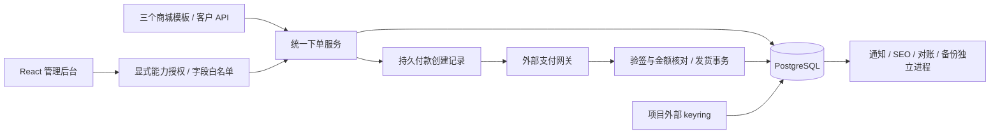

# 架构与运行边界

对应正式版本 **v1.0.8**，核对日期：2026-10-04。部署操作见 [首次安装](../DEPLOY.md)，实际测试与镜像发布证据见 [当前版本验收](../tests/README.md#当前正式版验收)。

CardShop 使用 Laravel 模块化单体，PostgreSQL 是订单、库存、付款回执与任务状态的事实来源，Redis 提供会话、限流和短期锁。React 管理后台与三个 Blade 商城模板共用服务端业务服务。

## 下单与付款

`OrderService` 为网页和 API 统一校验商品状态、数量、价格、优惠与额度，并在事务中锁定库存和领取优惠次数。商品规则在库存事务内重新读取；不会接受买家提交的实付金额或已支付标记。过期订单按100条一批扫描，单笔处理重新锁定并校验状态，避免覆盖同时完成的付款。

网页下单标识由服务端签名并绑定浏览器和商品，数据库唯一约束保证同一操作只创建一次。API 提供 `Idempotency-Key`，同一令牌的同键同参数找回原订单，不同参数返回409。API最终响应加密持久保存，临时202不当作已完成响应缓存。

付款创建记录保存执行租约、成功结果和不确定状态。库存事务提交后才调用外部网关。网关超时、进程中断、HTTP 408/5xx、无效成功响应等不能证明远端未建单，因此不自动再次创建交易；保留原订单，返回安全提示并进入核对。明确的配置错误或业务拒绝允许按原业务规则处理。已有付款回执仍按统一验签、金额与渠道校验进入发货事务。

通知属于至少一次投递，外部服务收到请求但本地未记录成功时可能重发。付款创建采用更保守的不确定状态，不能用通知重试策略重复创建支付。

## 卡密与权限

卡密和六种敏感配置使用外部 keyring 的 AES-256-GCM 密文，关联数据绑定用途；缺密钥、密文篡改或未转换原文都拒绝读取。敏感设置缓存只保存密文。卡密查重使用独立稳定 HMAC 指纹，不通过原文或可逆索引检索；模型写入、批量导入和关系更新统一处理加密。

keyring 位于项目之外，生产通过只读挂载提供。它包含版本化加密密钥和独立指纹密钥，不能用 `APP_KEY` 替代。商城备份不包含 keyring；必须单独安全备份，轮换时保留旧加密版本和指纹密钥。

后台路由明确声明能力，统一 Policy 检查店主及员工权限；未声明能力的受保护动作默认拒绝。卡密和资金操作有独立权限。响应通过 Resource 字段白名单输出，模型未来新增字段不会自动进入接口；接口错误只返回受控分类和请求编号。买家卡密仍要求当前订单凭据验证和实际已付状态。

### 库存状态

| 状态 | 含义 | 可售库存与处理规则 |
| --- | --- | --- |
| `unsold` | 未售出 | 计入可售数量，可被下单或售后换卡领取；可暂停、登记线下售出或删除 |
| `disabled` | 停用 | 不计入可售数量，不参与下单和换卡；仍参与导入查重，核实后可恢复为 `unsold` |
| `locked` | 待付款订单预留 | 不计入可售数量；通过订单付款、取消或到期流程处理，拒绝人工切换库存状态 |
| `sold` | 已交付或线下已售 | 不计入可售数量；订单关联或已换出卡不能回库，仅无订单关联且未换出的线下售出记录可撤销 |

人工状态操作和下单使用数据库行锁协调；停用卡须先恢复才可登记线下售出，已售卡不能直接改为停用。线下售出只记录卡密状态和操作日志，不生成商城订单、付款回执或销售额。售后换出的旧卡保持已售，并通过替换标记退出当前交付结果，不恢复为库存。

### 后台入口与授权

系统设置中的“支付设置”统一管理 EPay、USDT 和自动对账总开关；“邮件设置”集中 SMTP、测试邮件和模板。任务中心 `/tasks` 提供通知、对账和 SEO 三个页签，运维 `/operations` 提供健康、素材和备份；路由相对于配置的后台前缀。

这些分组不合并服务端权限：通知按 `notifications`、SEO 按 `content` 授权，对账查看同时要求 `maintenance:read` 和 `orders:read`，对账重试同时要求两类写权限及启用自动对账。完整备份仍为店主专属。前端隐藏无权入口，后端独立校验每个请求，权限定义集中在 `config/admin_permissions.php`。

## 任务与部署

正式镜像支持 `linux/amd64` 和 `linux/arm64`。CI 分别在原生 `ubuntu-24.04` 与 `ubuntu-24.04-arm` runner 上执行 PHP、Node、Shell 回归和真实 PostgreSQL 恢复测试，再构建本机架构的应用及 Nginx 镜像。生产验收检查全部九个服务的镜像架构、64 位 PHP、首次初始化、HTTP、任务心跳与重启不变量，不依赖 QEMU 模拟执行。

标签发布时，每个平台只上传已通过容器验收的镜像，并将不可变摘要传给汇总任务。两个平台任一失败都不会进入正式索引发布。汇总任务不重新构建，而是合并已测摘要、验证索引恰好包含 AMD64 与 ARM64，然后发布同一版本的应用和 Nginx 多架构标签；重试不得覆盖包含不同摘要的既有版本。操作员确认整个发布流水线成功后再公开 Release。两种架构使用相同源码、Compose、配置和迁移；32 位系统不在正式支持范围。

调度器只负责排队、到期处理与轻量检查。通知、SEO、付款核对和完整备份各自运行，故障和耗时互相隔离。核对任务有持久状态、唯一活动任务、租约及失败重试；缺少网关交易号或不兼容网关时保留人工核对，不重建付款。财务异常以稳定原因代码驱动状态判断，公开说明文字不控制结案。

生产使用多阶段构建的应用与 Nginx 镜像，依赖和前端资源在构建时准备。运行镜像只读，配置和密钥在外部，数据库迁移和初始化通过一次性任务显式执行。CI 使用独立测试库和 Redis 命名空间，验证测试、构建产物、依赖审计与生产 Compose；标签构建发布镜像并记录摘要。部署步骤见 [首次安装](../DEPLOY.md)。

`shop:ready` 验证连接、全部迁移、外部密钥、资源与存储；`shop:health` 检查工作进程与业务积压。HTTP响应携带 `X-Request-ID` 供日志定位，探针不输出连接详情或密钥。

## 恢复

正式库恢复要求维护模式和全流程排他锁；HTTP与业务进程持有共享锁，未结束请求会阻止恢复。PostgreSQL恢复使用单事务，文件先准备原副本，数据库失败时撤销已发布文件。恢复完成或失败后都不自动开放商城；由运维核对数据与配置，再重启进程并退出维护。

排他锁依赖所有进程共享同一个存储卷。直接 SQL、外部脚本或跨主机独立存储不在该锁保护内，恢复时须一并停写。一次主机故障无法通过数据库事务使多系统变更原子完成，因此保留私有恢复暂存和维护状态供人工处理。

自动化测试覆盖当前场景，真实网关到账、外部邮件与生产代理仍需对应部署环境验收。
